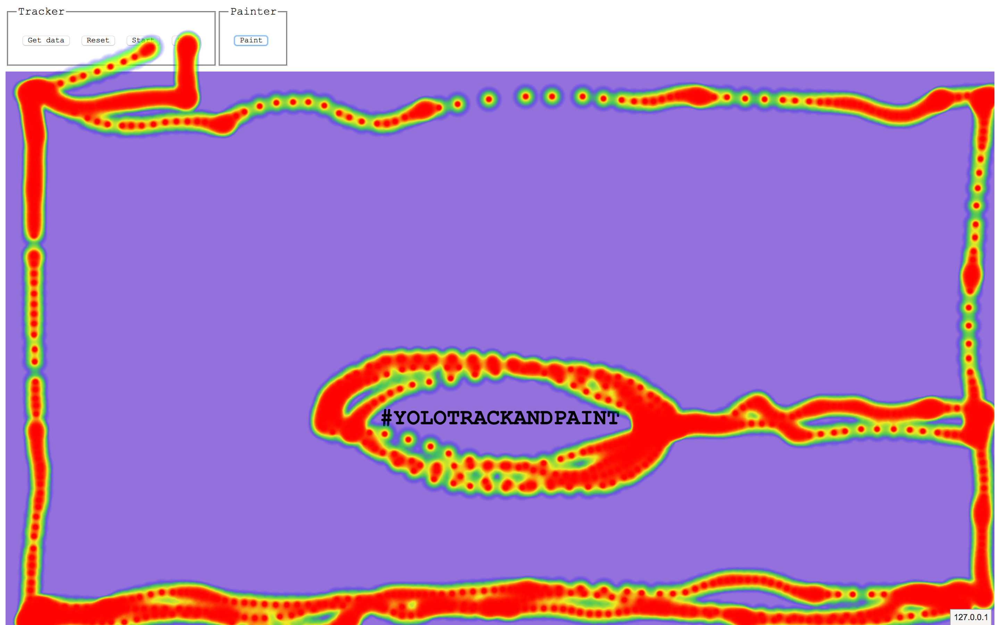

# purple-pluto

## Description

Tool for tracking visitor activity on your web application. Deploying the code from this repository will allow you to record and store data of (x,y) coordinates from visitor's following actions:

- Mouse hover
- (more to follow)

## Usage

Todo: add usage description

## Methods

Todo: add methods description

## Config

Todo: add config description

## Requirements

- node.js
- yarn

## Example

```
yarn
yarn start:example
```

The example is running at [http://localhost:8080/](http://localhost:8080/)


